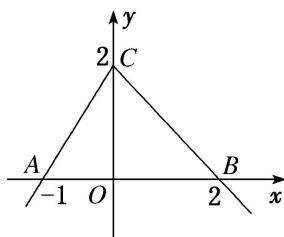

<!-- question-source:start -->
8. 如图, 函数 $f(x)$ 的图象为两条射线 $CA$ , $CB$ 组成的折线, 如果不等式 $f(x) \geq x^{2} - x - a$ 的解集中有且仅有 1 个整数, 则实数 $a$ 的取值范围是 ( )

A. $\{a| - 2 < a < -1\}$ B. $\{a| - 2 \leq a < -1\}$ C. $\{a| - 2 \leq a < 2\}$ D. $\{a|a \geq -2\}$
<!-- question-source:end -->

![[高中/总复习/专题/函数/专题10 函数图象的应用-函数/考点03_利用函数图象解不等式/对点训练/answers/Q00044400A1.md]]
