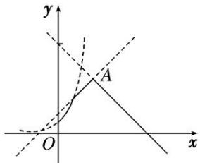

> [!faq]- 《专题10 函数图象的应用-函数》例题解析
>
> > [!success]- **【答案】** 详见解析
>
> > [!note]- **【分析】**
> > 本题未单列分析。
>
> > [!note]- **【解析】**
> > 答案 6 解析 $f(x) = \min \{2^x, x + 2, 10 - x\} (x \geq 0)$ 的图象如图中实线所示. 令 $x + 2 = 10 - x$ , 得 $x = 4$ . 故当 $x = 4$ 时, $f(x)$ 取最大值, 又 $f(4) = 6$ , 所以 $f(x)$ 的最大值为 6.
> > 
