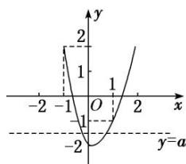

> [!faq]- 《专题10 函数图象的应用-函数》例题解析
>
> > [!success]- **【答案】** B
>
> > [!note]- **【分析】**
> > 本题未单列分析。
>
> > [!note]- **【解析】**
> > 答案 B 解析 根据题意可知 $f(x)=\left\{\begin{aligned}&2x+2,&x\leq0,\\&-x+2,&x>0,\end{aligned}\right.$ 不等式 $f(x)\geq x^{2}-x-a$ 等价于 $a\geq x^{2}-x-f(x)$ ，令 $g(x)=x^{2}-x-f(x)=\left\{\begin{aligned}&x^{2}-3x-2,&x\leq0,\\&x^{2}-2,&x>0,\end{aligned}\right.$
> > 
> > 作出 $g(x)$ 的大致图象，如图所示，又 $g(0) = -2, g(1) = -1, g(-1) = 2, \therefore$ 要使不等式的解集中有且仅有 1 个整数，则 $-2 \leq a < -1$ ，则实数 a 的取值范围是 $\{a \mid -2 \leq a < -1\}$ 。
> >
> > 故选 **B**.
