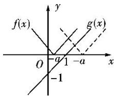

> [!faq]- 《专题10 函数图象的应用-函数》例题解析
>
> > [!success]- **【答案】** 详见解析
>
> > [!note]- **【分析】**
> > 本题未单列分析。
>
> > [!note]- **【解析】**
> > 答案 $a \geq -1$ 解析 如图，要使 $f(x) \geq g(x)$ 恒成立，则 $-a \leq 1$ ，所以 $a \geq -1$ .
> > 
