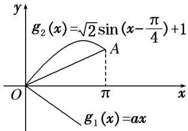

> [!faq]- 《专题10 函数图象的应用-函数》例题解析
>
> > [!success]- **【答案】** 详见解析
>
> > [!note]- **【分析】**
> > 本题未单列分析。
>
> > [!note]- **【解析】**
> > 答案 $\left[-\infty, \frac{2}{\pi}\right]$ 解析 由 $f(x) \leq 1 + \sin x$ ，得 $ax + \cos x \leq 1 + \sin x$ ，即 $ax \leq \sqrt{2} \sin \left(x - \frac{\pi}{4}\right) + 1$ ，构造函数 $g_{1}(x) = ax$ ， $g_{2}(x) = \sqrt{2} \sin \left(x - \frac{\pi}{4}\right) + 1$ ，如图所示，若使 $ax \leq \sqrt{2} \sin \left(x - \frac{\pi}{4}\right) + 1$ 恒成立，
> >
> > 
> >
> > 则函数 $g_{1}(x)=ax$ 的图象总在函数 $g_{2}(x)=\sqrt{2}\sin\left(x-\frac{\pi}{4}\right)+1$ 的图象的下方．因为 $x\in[0,\pi]$ ， $A(\pi,2)$ ， $k_{OA}=\frac{2}{\pi}$ ，所以 a 的取值范围为 $\left[-\infty,\frac{2}{\pi}\right]$ .
