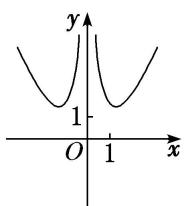
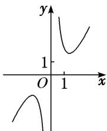
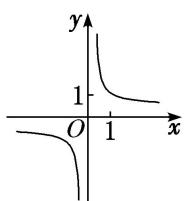
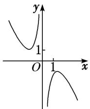

<!-- question-source:start -->
[例 2] (1) (2018·全国II) 函数 $f(x)=\frac{\mathrm{e}^{x}-\mathrm{e}^{-x}}{x^{2}}$ 的图象大致为()

<!-- question-source:end -->

![[高中/总复习/专题/函数/专题10 函数的图象-函数/考点02_函数图象的识别/例题/answers/Q00041027A1.md]]
