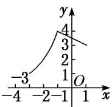
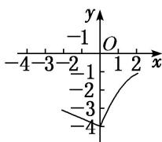

<!-- question-source:start -->
(3) 已知定义在区间 $[0, 4]$ 上的函数 $y = f(x)$ 的图象如图所示，则 $y = -f(2 - x)$ 的图象为（）

A

B

C

D
<!-- question-source:end -->

![[高中/总复习/专题/函数/专题10 函数的图象-函数/考点02_函数图象的识别/例题/answers/Q00044404A1.md]]
