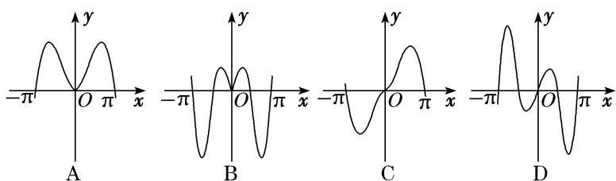
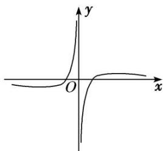
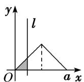
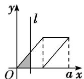
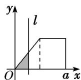

> [!faq]- 《专题10 函数的图象-函数》例题解析
>
> > [!success]- **【答案】** C
>
> > [!note]- **【分析】**
> > 本题未单列分析。
>
> > [!note]- **【解析】**
> > 答案 B 解析 $\because y = e^{x} - e^{-x}$ 是奇函数， $y = x^2$ 是偶函数， $\therefore f(x) = \frac{e^{x} - e^{-x}}{x^2}$ 是奇函数，图象关于原点对称，排除 A 选项；当 $x = 1$ 时， $f(1) = e - \frac{1}{e} > 0$ ，排除 D 选项；又 $e > 2$ ， $\therefore \frac{1}{e} < \frac{1}{2}$ ， $\therefore e - \frac{1}{e} > 1$ ，排除 C 选项。故选 B.
> > (2) (2018·浙江) 函数 $y=2^{|x|}\sin 2x$ 的图象可能是()
> > 
> > 答案 D 解析 由 $y = 2^{|x|}\sin 2x$ 知函数的定义域为 R，令 $f(x) = 2^{|x|}\sin 2x$ ，则 $f(-x) = 2^{| - x|}\sin (-2x) = -2^{|x|}\sin 2x$ 。 $\because f(x) = -f(-x), \therefore f(x)$ 为奇函数。 $\therefore f(x)$ 的图象关于原点对称，故排除 A、B。令 $f(x) = 2^{|x|}\sin 2x = 0$ ，解得 $x = \frac{k\pi}{2} (k \in \mathbb{Z})$ ， $\therefore$ 当 $k = 1$ 时， $x = \frac{\pi}{2}$ ，故排除 C，选 D.
> > (3) 已知定义在区间 $[0, 4]$ 上的函数 $y = f(x)$ 的图象如图所示，则 $y = -f(2 - x)$ 的图象为（）
> > 
> > 
> > A
> > 
> > B
> > 
> > 
> > C
> > D
> > 答案 D 解析 法一：先作出函数 $y=f(x)$ 的图象关于 y 轴的对称图象，得到 $y=f(-x)$ 的图象；然后将 $y=f(-x)$ 的图象向右平移 2 个单位，得到 $y=f(2-x)$ 的图象；再作 $y=f(2-x)$ 的图象关于 x 轴的对称图象，得到 $y=-f(2-x)$ 的图象．故选 D.
> > 法二：先作出函数 $y = f(x)$ 的图象关于原点的对称图象，得到 $y = -f(-x)$ 的图象；然后将 $y = -f(-x)$ 的图象向右平移2个单位，得到 $y = -f(2 - x)$ 的图象．故选D.
> > (4) 已知函数 $f(x)$ 的图象如图所示，则 $f(x)$ 的解析式可以是()
> > 
> > A. $f(x) = \frac{\ln|x|}{x}$ B. $f(x) = \frac{\mathrm{e}^x}{x}$ C. $f(x) = \frac{1}{x^2} - 1$ D. $f(x) = x - \frac{1}{x}$
> > 答案 A 解析 由函数图象可知，函数 $f(x)$ 为奇函数，应排除 B、C。若函数为 $f(x) = x - \frac{1}{x}$ ，则 $x \to +\infty$ 时， $f(x) \to +\infty$ ，排除 D。
> > (5) 如图, 有四个平面图形分别是三角形、平行四边形、直角梯形、圆. 垂直于 $x$ 轴的直线 $l: x = t (0 \leq t \leq a)$ 经过原点 $O$ 向右平行移动, $l$ 在移动过程中扫过平面图形的面积为 $y$ (图中阴影部分), 若函数 $y = f(x)$ 的大致图象如右图所示, 那么平面图形的形状不可能是( )
> > 
> > 
> > A
> > 
> > B
> > 
> > C
> > 
> > D
> > 答案 C 解析 由 $y = f(x)$ 的图象可知面积递增的速度先快后慢，对于选项 C，后半程是匀速递增，所以平面图形的形状不可能是 C．故选 C.
> > 【对点训练】
