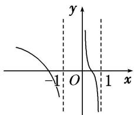
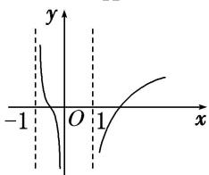
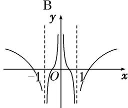

<!-- question-source:start -->
6. 函数 $f(x) = \ln \left( x - \frac{1}{x} \right)$ 的图象是（）

  
C

  
D
<!-- question-source:end -->

![[高中/总复习/专题/函数/专题10 函数的图象-函数/考点02_函数图象的识别/对点训练/answers/Q00041033A1.md]]
