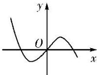
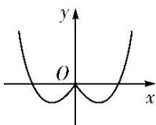

<!-- question-source:start -->
11. 已知图①中的图象是函数 $y = f(x)$ 的图象，则图②中的图象对应的函数可能是( )

①

②

A. $y = f(|x|)$ B. $y = |f(x)|$ C. $y = f(-|x|)$ D. $y = -f(-|x|)$
<!-- question-source:end -->

![[高中/总复习/专题/函数/专题10 函数的图象-函数/考点02_函数图象的识别/对点训练/answers/Q00041037A1.md]]
