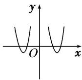
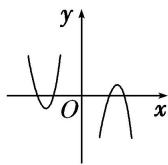

> [!faq]- 《专题10 函数的图象-函数》例题解析
>
> > [!success]- **【答案】** D
>
> > [!note]- **【分析】**
> > 本题未单列分析。
>
> > [!note]- **【解析】**
> > 答案 D 解析 令 $f(x) = 0$ 可得 $x = \pm 1$ ，或 $x = k\pi (k \neq 0, k \in \mathbf{Z})$ ，又 $f(-x) = \begin{bmatrix} -x + \frac{1}{x} \end{bmatrix} \sin (-x) = \begin{bmatrix} x - \frac{1}{x} \end{bmatrix} \sin \left( -x \right)$ .
> >
> > $x = f(x)$ ，即函数 $f(x) = \left[ x - \frac{1}{x} \right] \sin x$ 是偶函数，且经过点 $(1, 0), (\pi, 0), (2\pi, 0), (3\pi, 0), \ldots$ ，故选D. 9. 已知函数 $f(x) = -x^2 + 2$ ， $g(x) = \log_2 |x|$ ，则函数 $F(x) = f(x) \cdot g(x)$ 的图象大致为（）
> >
> > 
> >
> > A
> >
> > 
> >
> > B
> >
> > 
> >
> > C
> >
> > 
> >
> > D
> >
> > 9. 答案 B 解析 $f(x)$ , $g(x)$ 均为偶函数, 则 $F(x)$ 也为偶函数, 由此排除 A, D. 当 $x > 2$ 时, $-x^2 + 2 < 0$ , $\log_2 |x| > 0$ , 所以 $F(x) < 0$ , 排除 C,
> >
> > 故选 **B**.
