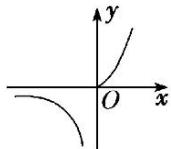
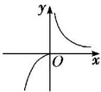

> [!faq]- 《专题10 函数的图象-函数》例题解析
>
> > [!success]- **【答案】** D
>
> > [!note]- **【解析】**
> > 答案 D 解析 法一：由题设得函数 $g(x) = -f(-x) = \begin{cases} -x^{2}, & x \leq 0, \\ \frac{1}{x}, & x > 0, \end{cases}$ 据此可画出该函数的图象，如题图选项 D 中图象．故选 D.
> >
> > 法二：先画出函数 $f(x)$ 的图象，如图1所示，再根据函数 $f(x)$ 与 $-f(-x)$ 的图象关于坐标原点对称，即可画出函数 $-f(-x)$ ，即 $g(x)$ 的图象，如图2所示．故选D.
> >
> >   
> > 图1
> >
> >   
> > 图2
