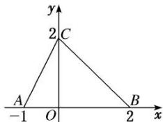

<!-- question-source:start -->
[例 3] (1) 设奇函数 $f(x)$ 在 $(0, +\infty)$ 上为增函数，且 $f(1)=0$ ，则不等式 $\frac{f(x)-f(-x)}{x}<0$ 的解集为（）

A. $(-1, 0) \cup (1, +\infty)$ B. $(-\infty, -1) \cup (0, 1)$ C. $(-\infty, -1) \cup (1, +\infty)$ D. $(-1, 0) \cup (0, 1)$

(2) 如图，函数 $f(x)$ 的图象为折线 ACB，则不等式 $f(x) \geq \log_{2}(x + 1)$ 的解集为 \_\_\_\_.

答案 $\{x| - 1 < x \leq 1\}$ 解析令 $y = \log_2(x + 1)$ ，作出函数 $y = \log_2(x + 1)$ 图象如图所示。由 $\left\{ \begin{array}{l} x + y = 2, \\ y = \log_2(x + 1) \end{array} \right.$ 得 $\left\{ \begin{array}{l} x = 1, \\ y = 1. \end{array} \right.$ ∴结合图象知不等式 $f(x) \geq \log_2(x + 1)$ 的解集为 $\{x | -1 < x \leq 1\}$ 。

(3) 若函数 $f(x)$ 是周期为 4 的偶函数，当 $x \in [0, 2]$ 时， $f(x) = x - 1$ ，则不等式 $xf(x) > 0$ 在 $(-1, 3)$ 上的解集为（）

A. (1, 3)    B. (-1, 1)    C. (-1, 0) ∪ (1, 3)    D. (-1, 0) ∪ (0, 1)

(4) 若不等式 $(x - 1)^2 < \log_a x (a > 0$ ，且 $a \neq 1)$ 在 $x \in (1, 2)$ 内恒成立，则实数 $a$ 的取值范围为（）A. (1, 2] B. $\left[\frac{\sqrt{2}}{2}, 1\right]$ C. $(1, \sqrt{2})$ D. $(\sqrt{2}, 2)$

(5) 若关于 $x$ 的不等式 $4a^{x-1} < 3x - 4 (a > 0$ , 且 $a \neq 1)$ 对于任意的 $x > 2$ 恒成立, 则实数 $a$ 的取值范围为 \_\_\_\_.
<!-- question-source:end -->

![[高中/总复习/专题/函数/专题10 函数的图象及应用-函数/专题十_函数图象的应用/考点三_利用函数图象解不等式/例题选讲/例题/answers/Q00030127A1.md]]
