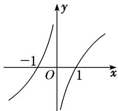

> [!faq]- 教师版例题解析
>
> > [!success]- **【答案】** (1) D；(2) C；(3) A；(4) $\left[0, \frac{1}{2}\right]$
>
> > [!note]- **【分析】**
> > 本题未单列分析。
>
> > [!note]- **【解析】**
> > 答案 D 解析 因为 $f(x)$ 为奇函数，所以不等式 $\frac{f(x)-f(-x)}{x}<0$ 可化为 $\frac{f(x)}{x}<0$ ，即 $xf(x)<0$ ， $f(x)$ 的大致图象如图所示．所以 $xf(x)<0$ 的解集为 $(-1,0)\cup(0,1)$ .
> > 
> > 答案 C 解析 作出函数 $f(x)$ 的图象如图所示．当 $x \in (-1, 0)$ 时，由 $xf(x) > 0$ 得 $x \in (-1, 0)$ ；当 $x \in (0, 1)$ 时，由 $xf(x) > 0$ 得 $x \in \emptyset$ ；当 $x \in (1, 3)$ 时，由 $xf(x) > 0$ 得 $x \in (1, 3)$ ．故 $x \in (-1, 0) \cup (1, 3)$ .
> > 
> > 答案 A 解析 要使当 $x \in (1, 2)$ 时，不等式 $(x - 1)^2 < \log_a x$ 恒成立，只需函数 $y = (x - 1)^2$ 在 $(1, 2)$ 上的图象在 $y = \log_a x$ 的图象的下方即可．当 $0 < a < 1$ 时，显然不成立；当 $a > 1$ 时，如图，要使 $x \in (1, 2)$ 时， $y = (x - 1)^2$ 的图象在 $y = \log_a x$ 的图象的下方，只需 $(2 - 1)^2 \leq \log_a 2$ ，即 $\log_a 2 \geq 1$ ，解得 $1 < a \leq 2$ ，故实数 $a$ 的取值范围是 $(1, 2]$ .
> > 答案 $\left[0, \frac{1}{2}\right]$ 解析 不等式 $4a^{x-1} < 3x - 4$ 等价于 $a^{x-1} < \frac{3}{4}x - 1$ . 令 $f(x) = a^{x-1}$ , $g(x) = \frac{3}{4}x - 1$ , 当 $a > 1$ 时, 在同一坐标系中作出两个函数的图象如图(1)所示, 由图知不满足条件; 当 $0 < a < 1$ 时, 在同一坐标系中作出两个函数的图象如图(2)所示, 当 $x \geq 2$ 时, $f(2) \leq g(2)$ , 即 $a^{2-1} \leq \frac{3}{4} \times 2 - 1$ , 解得 $a \leq \frac{1}{2}$ , 所以 $a$ 的取值范围是 $\left[0, \frac{1}{2}\right]$ .
> > 
> > 图（1）
> > 
> > 图（2）
