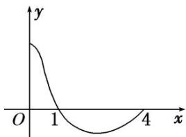

<!-- question-source:start -->
7. 函数 $f(x)$ 是定义在 $[-4, 4]$ 上的偶函数，其在 $[0, 4]$ 上的图象如图所示，那么不等式 $\frac{f(x)}{\cos x} < 0$ 的解集为 \_\_\_\_.

<!-- question-source:end -->

![[高中/总复习/专题/函数/专题10 函数的图象及应用-函数/专题十_函数图象的应用/考点三_利用函数图象解不等式/对点训练/题目/answers/Q00030134A1.md]]
