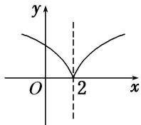

> [!faq]- 教师版对点训练解析
>
> > [!success]- **【答案】** B
>
> > [!note]- **【分析】**
> > 本题未单列分析。
>
> > [!note]- **【解析】**
> > 答案 B 解析 因为函数 $f(x) = \lg (|x - 2| + 1)$ ，所以函数 $f(x + 2) = \lg (|x| + 1)$ 是偶函数；由 $y = \lg x$ 图象向左平移 1 个单位长度 $y = \lg (x + 1)$ 去掉 $y$ 轴左侧的图象，以 $y$ 轴为对称轴，作 $y$ 轴右侧图象的对称图象 $y = \lg (|x| + 1)$ 图象向右平移 2 个单位长度 $y = \lg (|x - 2| + 1)$ ，如图，可知 $f(x)$ 在 $(- \infty, 2)$ 上是减函数，在 $(2, +\infty)$ 上是增函数；由图象可知函数存在最小值为 0。所以①②正确。
> > 
