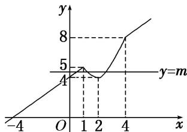

> [!faq]- 教师版对点训练解析
>
> > [!success]- **【答案】** 详见解析
>
> > [!note]- **【分析】**
> > 本题未单列分析。
>
> > [!note]- **【解析】**
> > 答案 (4, 5) 解析 设 $g(x) = \min \{x, x^2 - 4x + 4\}$ ，则 $f(x) = g(x) + 4$ ，故把 $g(x)$ 的图象向上平移 4 个单位长度，可得 $f(x)$ 的图象，函数 $f(x) = \min \{x, x^2 - 4x + 4\} + 4$ 的图象如图所示，由于直线 $y = m$ 与函数 $y = f(x)$ 的图象有 3 个交点，数形结合可得 $m$ 的取值范围为 (4, 5).
> > 
