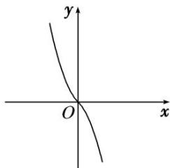

> [!faq]- 教师版对点训练解析
>
> > [!success]- **【答案】** 详见解析
>
> > [!note]- **【分析】**
> > 本题未单列分析。
>
> > [!note]- **【解析】**
> > 答案 $(-3, 1)$ 解析 如图，画出 $f(x)$ 的图象，由图象易得 $f(x)$ 在 $\mathbf{R}$ 上单调递减， $\because f(3 - a^2) < f(2a)$ ， $\therefore 3 - a^2 > 2a$ ，解得 $-3 < a < 1$ .
> > 
