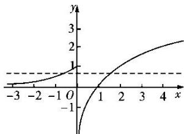

> [!faq]- 教师版对点训练解析
>
> > [!success]- **【答案】** 详见解析
>
> > [!note]- **【分析】**
> > 本题未单列分析。
>
> > [!note]- **【解析】**
> > 答案 (0, 1] 解析 当 $x \leq 0$ 时, $0 < 2^{x} \leq 1$ , 所以由图象可知要使方程 $f(x) - a = 0$ 有两个实根, 即 $f(x) = a$ 有两个根, 则 $0 < a \leq 1$ .
> > 
