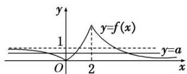

> [!faq]- 教师版对点训练解析
>
> > [!success]- **【答案】** 详见解析
>
> > [!note]- **【分析】**
> > 本题未单列分析。
>
> > [!note]- **【解析】**
> > 答案 (0, 1) 解析 画出函数 $f(x)$ 的图象如图所示，观察图象可知，若方程 $f(x) - a = 0$ 有三个不同的实数根，
> > 
> > 即函数 $y=f(x)$ 的图象与直线 y=a 有 3 个不同的交点，此时需满足 0<a<1.
