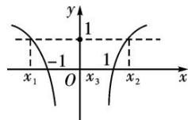

> [!faq]- 教师版对点训练解析
>
> > [!success]- **【答案】** 详见解析
>
> > [!note]- **【分析】**
> > 本题未单列分析。
>
> > [!note]- **【解析】**
> > 答案 0 解析 函数 $f(x)$ 的图象如图，方程 $f(x) = c$ 有三个根，即 $y = f(x)$ 与 $y = c$ 的图象有三个交点，易知 $c = 1$ ，且一根为 0，由 $\lg |x| = 1$ 知另两根为 -10 和 10，所以 $x_{1} + x_{2} + x_{3} = 0$ .
> > 
