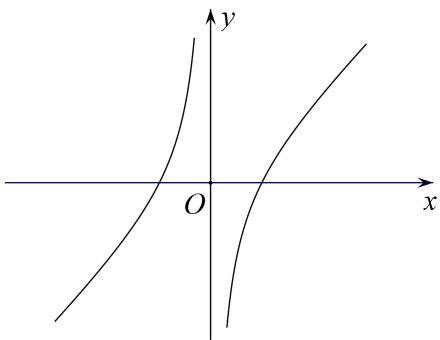
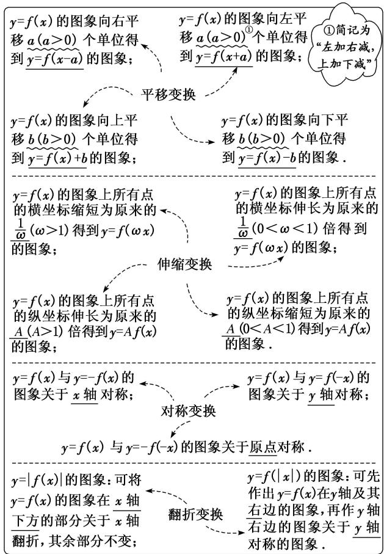
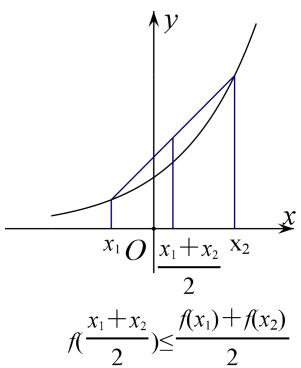
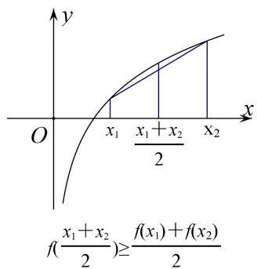

## 专题十 函数的图象

## 一、基础知识

## 1. 做草图需要注意的信息点

做草图的原则是：速度快且能提供所需要的信息，通过草图能够显示出函数的性质。在作图中草图框架的核心要素是函数的单调性，对于一个陌生的可导函数，可通过对导函数的符号分析得到单调区间，图像形状依赖于函数的凹凸性，可由二阶导数的符号决定(详见“知识点讲解与分析”的第3点)，这两部分确定下来，则函数大致轮廓可定，但为了方便数形结合，让图像更好体现函数的性质，有一些信息点也要在图像中通过计算体现出来，下面以常见函数为例，来说明作图时常体现的几个信息点。

(1)一次函数： $y = kx + b$ ，若直线不与坐标轴平行，通常可利用直线与坐标轴的交点来确定直线.

特点：两点确定一条直线.

信息点：与坐标轴的交点.

(2)二次函数： $y = a(x - h)^2 + k$ ，其特点在于存在对称轴，故作图时只需做出对称轴一侧的图像，另一侧由对称性可得。函数先减再增，存在极值点——顶点，若与坐标轴相交，则标出交点坐标可使图像更为精确。

特点：对称性.

信息点：对称轴，极值点，坐标轴交点.

(3)反比例函数： $y = \frac{1}{x}$ ，其定义域为 $(- \infty, 0) \cup (0, +\infty)$ ，是奇函数，只需做出正版轴图像即可(负半轴依靠对称做出)，坐标轴为函数的渐近线.

特点：奇函数（图像关于原点中心对称），渐近线.

信息点：渐近线.

注：

(1)所谓渐近线：是指若曲线无限接近一条直线但不相交，则称这条直线为渐近线．渐近线在作图中的作用体现为对曲线变化给予了一些限制，例如在反比例函数中，x轴是渐近线，那么当 $x\to+\infty$ ，曲线无限向x轴接近，但不相交，则函数在x正半轴就不会有x轴下方的部分.

(2)水平渐近线的判定：需要对函数值进行估计：若 $x \to +\infty$ （或 $-\infty$ ）时， $f(x) \to \text{常数 } C$ ，则称直线 $y = C$ 为函数 $f(x)$ 的水平渐近线.

例如： $y=2^{x}$ ，当 $x\to+\infty$ 时， $y\to+\infty$ ，故在 x 轴正方向不存在渐近线。当 $x\to-\infty$ 时， $y\to0$ ，故在 x 轴负方向存在渐近线 y=0。

(3)竖直渐近线的判定: 首先 $f(x)$ 在 x=a 处无定义, 且当 $x \to a$ 时, $f(x) \to +\infty$ (或 $-\infty$ ), 那么称 x=a 为 $f(x)$ 的竖直渐近线

例如： $y=\log_{2}x$ 在 x=0 处无定义，当 $x\to0$ 时， $f(x)\to-\infty$ ，所以 x=0 为 $y=\log_{2}x$ 的一条渐近线.

综上所述：在作图时以下信息点值得通过计算后体现在图像中：与坐标轴的交点；对称轴与对称中心；极值点；渐近线.

例：作出函数 $f(x) = x - \frac{1}{x}$ 的图像.

分析：定义域为 $(- \infty, 0) \cup (0, +\infty)$ ，且 $f(x)$ 为奇函数，故先考虑 $x$ 正半轴情况.

$f^{\prime}(x) = 1 + \frac{1}{x^{2}} >0$ 故函数单调递增， $f''(x) = -\frac{2}{x^3} < 0$ ，故函数为上凸函数，当 $x\to +\infty$ 时， $f(x)\rightarrow +\infty$ 无水平渐近线， $x\to 0$ 时， $f(x)\rightarrow -\infty$ ，所以 $y$ 轴为 $f(x)$ 的竖直渐近线。零点： $(1,0)$ ，由这些信息可做

出正半轴的草图，在根据对称性得到 $f(x)$ 完整图像：

## 2. 函数图象变换

3. 二阶导函数与函数的凹凸性:

(1) 下凸函数(如图 1)与上凸函数(如图 2)

图1

图2

(2)上凸函数特点：增区间增长速度越来越慢，减区间下降速度越来越快

下凸函数特点：增区间增长速度越来越快，减区间下降速度越来越慢

(3)与导数的关系：设 $f'(x)$ 的导函数为 $f''(x)$ （即 $f(x)$ 的二阶导函数），如图所示：增长速度受每一点切线斜率的变化情况的影响，下凸函数斜率随 $x$ 的增大而增大，即 $f'(x)$ 为增函数 $\Rightarrow f''(x) \geq 0$ ；上凸函数随 $x$ 的增大而减小，即 $f'(x)$ 为减函数 $\Rightarrow f''(x) \leq 0$ ；

综上所述：函数是上凸下凸可由导函数的增减性决定，进而能用二阶导函数的符号进行求解.

## 二、方法与技巧：

1. 在处理有关判断正确图像的选择题中，常用的方法是排除法，通过寻找四个选项的不同，再结合函数的性质即可进行排除，常见的区分要素如下：

(1)单调性：导函数的符号决定原函数的单调性，导函数图像位于 $x$ 轴上方的区域表示原函数的单调增区间，位于 $x$ 轴下方的区域表示原函数的单调减区间.

(2)函数零点周围的函数值符号：可通过带入零点附近的特殊点来进行区分.

(3)极值点

(4)对称性（奇偶性）——易于判断，进而优先观察.

(5)函数的凹凸性：导函数的单调性决定原函数的凹凸性，导函数增区间即为函数的下凸部分，减区间为函数的上凸部分．其单调性可由二阶导函数确定.

2. 利用图像变换作图的步骤

(1)寻找到模板函数 $f(x)$ (以此函数作为基础进行图像变换).

(2)找到所求函数与 $f(x)$ 的联系.

(3)根据联系制定变换策略，对图像进行变换.

例如：作图： $y=\left|\ln(x+1)\right|$

第一步寻找模板函数为： $f(x)=\ln x$ ；

第二步寻找联系：可得 $y=\left|f(x+1)\right|$ ;

第三步制定策略：由 $\left|f(x+1)\right|$ 特点可得：先将 $f(x)$ 图像向左平移一个单位，再将x轴下方图像向上进行翻折，然后按照方案作图即可.

3. 如何制定图象变换的策略

(1)在寻找到联系后可根据函数的形式了解变换所需要的步骤，其规律如下：

①若变换发生在“括号”内部，则属于横坐标的变换；

②若变换发生在“括号”外部，则属于纵坐标的变换.

例如： $y = f(3x + 1)$ ：可判断出属于横坐标的变换：有放缩与平移两个步骤.

$y = f(-x) + 2$ ：可判断出横纵坐标均需变换，其中横坐标的为对称变换，纵坐标的为平移变换.

(2)多个步骤的顺序问题：在判断了需要几步变换以及属于横坐标还是纵坐标的变换后，在安排顺序时注意以下原则：

①横坐标的变换与纵坐标的变换互不影响，无先后要求；

②横坐标的多次变换中，每次变换只有 x 发生相应变化.

例如： $y = f(x) \rightarrow y = f(2x + 1)$ 可有两种方案

方案一：先平移（向左平移1个单位），此时 $f(x) \rightarrow f(x + 1)$ 。再放缩（横坐标变为原来的 $\frac{1}{2}$ ），此时系数2只是添给x，即 $f(x + 1) \rightarrow f(2x + 1)$ 。

方案二：先放缩（横坐标变为原来的 $\frac{1}{2}$ ），此时 $f(x) \to f(2x)$ ，再平移时，若平移 $a$ 个单位，则 $f(2x) \to f(2(x + a)) = f(2x + 2a)$ (只对 $x$ 加 $a$ ），可解得 $a = \frac{1}{2}$ ，故向左平移 $\frac{1}{2}$ 个单位.

③纵坐标的多次变换中，每次变换将解析式看做一个整体进行.

例如： $y = f(x) \rightarrow y = 2f(x) + 1$ 有两种方案

方案一：先放缩： $y = f(x) \to y = 2f(x)$ ，再平移时，将解析式看做一个整体，整体加1，即 $y = 2f(x) \to y = (2f(x)) + 1$ .

方案二：先平移： $y = f(x) \rightarrow y = f(x) + 1$ ，则再放缩时，若纵坐标变为原来的 $a$ 倍，那么 $y = f(x) + 1 \rightarrow y = a(f(x) + 1)$ ，无论 $a$ 取何值，也无法达到 $y = 2f(x) + 1$ ，所以需要对前一步进行调整：平移 $\frac{1}{2}$ 个单位，再进行放缩即可 $(a = 2)$ .

## 4. 变换作图的技巧

(1)图像变换时可抓住对称轴, 零点, 渐近线. 在某一方向上他们会随着平移而进行相同方向的移动. 先把握住这些关键要素的位置, 有助于提高图像的精确性.

(2)图像变换后要将一些关键点标出：如边界点，新的零点与极值点，与 $y$ 轴的交点等.

## 三、常用结论

## 1. 函数图象自身的轴对称

(1) $f(-x)=f(x)\Leftrightarrow$ 函数 $y=f(x)$ 的图象关于y轴对称;

(2)函数 $y = f(x)$ 的图象关于 $x = a$ 对称 $\Leftrightarrow f(a + x) = f(a - x) \Leftrightarrow f(x) = f(2a - x) \Leftrightarrow f(-x) = f(2a + x)$ ;

(3)若函数 $y = f(x)$ 的定义域为 $\mathbf{R}$ ，且有 $f(a + x) = f(b - x)$ ，则函数 $y = f(x)$ 的图象关于直线 $x = \frac{a + b}{2}$ 对称.

## 2. 函数图象自身的中心对称

(1) $f(-x)=-f(x)\Leftrightarrow$ 函数 $y=f(x)$ 的图象关于原点对称;

(2)函数 $y = f(x)$ 的图象关于(a, 0)对称 $\Leftrightarrow f(a + x) = -f(a - x) \Leftrightarrow f(x) = -f(2a - x) \Leftrightarrow f(-x) = -f(2a + x)$ ;

(3)函数 $y=f(x)$ 的图象关于点 $(a, b)$ 成中心对称 $\Leftrightarrow f(a+x)=2b-f(a-x)\Leftrightarrow f(x)=2b-f(2a-x)$ .

## 3. 两个函数图象之间的对称关系

(1)函数 $y = f(a + x)$ 与 $y = f(b - x)$ 的图象关于直线 $x = \frac{b - a}{2}$ 对称(由 $a + x = b - x$ 得对称轴方程);

(2)函数 $y = f(x)$ 与 $y = f(2a - x)$ 的图象关于直线 $x = a$ 对称；

(3)函数 $y=f(x)$ 与 $y=2b-f(-x)$ 的图象关于点 $(0, b)$ 对称；

(4)函数 $y=f(x)$ 与 $y=2b-f(2a-x)$ 的图象关于点 $(a, b)$ 对称.

![[高中/总复习/专题/函数/专题10 函数的图象及应用-函数/专题十_函数的图象/考点一_作函数的图象/考点一_作函数的图象.md]]
![[高中/总复习/专题/函数/专题10 函数的图象及应用-函数/专题十_函数的图象/考点二_函数图象的识别/考点二_函数图象的识别.md]]
