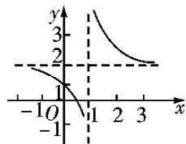
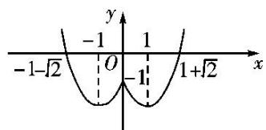
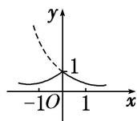
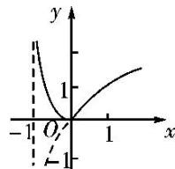

<!-- question-source:start -->
[例 1] 作出下列函数的图象

(1) $y = |x - 2| \cdot (x + 1)$ ; (2) $y = \frac{2x - 1}{x - 1}$ ; (3) $y = x^2 - 2|x| - 1$ ; (4) $y = (\frac{1}{2})^{|x|}$ ; (5) $y = |\log_2(x + 1)|$ .

(2) 因为 $y = \frac{2x - 1}{x - 1} = 2 + \frac{1}{x - 1}$ ，故函数图象可由 $y = \frac{1}{x}$ 的图象向右平移 1 个单位，再向上平移 2 个单位得到，如图.

(3) 因为 $y = \begin{cases} x^2 - 2x - 1, & x \geq 0, \\ x^2 + 2x - 1, & x < 0, \end{cases}$ 且函数为偶函数，先用描点法作出 $[0, +\infty)$ 上的图象，再根据对称性作出 $(- \infty, 0)$ 上的图象，即得函数 $y = x^2 - 2|x| - 1$ 的图象，如图.

(4) 作出 $y = \left(\frac{1}{2}\right)^x$ 的图象，保留 $y = \left(\frac{1}{2}\right)^x$ 图象中 $x \geq 0$ 的部分，加上 $y = \left(\frac{1}{2}\right)^x$ 的图象中 $x > 0$ 部分关于 $y$ 轴的对称部分，即得 $y = \left(\frac{1}{2}\right)^{|x|}$ 的图象，如图中实线部分.

(5) 将函数 $y = \log_2 x$ 的图象向左平移 1 个单位，再将 $x$ 轴下方的部分沿 $x$ 轴翻折上去，即可得到函数 $y = |\log_2(x + 1)|$ 的图象，如图中实线部分.

A

<!-- question-source:end -->

![[高中/总复习/专题/函数/专题10 函数的图象及应用-函数/专题十_函数的图象/考点一_作函数的图象/例题选讲/例题/answers/Q00030041A1.md]]
