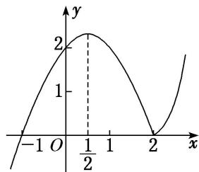

> [!faq]- 教师版例题解析
>
> > [!success]- **【答案】** 详见解析
>
> > [!note]- **【分析】**
> > 本题未单列分析。
>
> > [!note]- **【解析】**
> > [解析](1) 当 $x \geq 2$ ，即 $x - 2 \geq 0$ 时， $y = (x - 2)(x + 1) = x^{2} - x - 2 = \left(x - \frac{1}{2}\right)^{2} - \frac{9}{4}$ ; 当 x < 2，即 x - 2 < 0 时，y =
> > $-(x-2)(x+1)=-x^{2}+x+2=-\left(x-\frac{1}{2}\right)^{2}+\frac{9}{4}.$ 所以 $y=\left\{\begin{aligned}&\left(x-\frac{1}{2}\right)^{2}-\frac{9}{4},&x\geq2,\\ &-\left(x-\frac{1}{2}\right)^{2}+\frac{9}{4},&x<2.\end{aligned}\right.$
> > 
> > 这是分段函数，每段函数的图象可根据二次函数图象作出(其图象如图所示).
