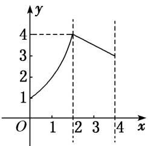
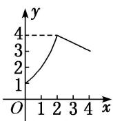
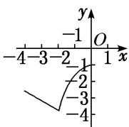
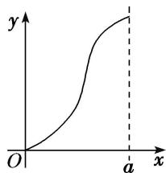
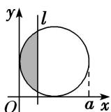

<!-- question-source:start -->
[例 2] (1) (2018·全国II) 函数 $f(x)=\frac{\mathrm{e}^{x}-\mathrm{e}^{-x}}{x^{2}}$ 的图象大致为()

(2) (2018·浙江) 函数 $y=2^{|x|}\sin 2x$ 的图象可能是()

(3) 已知定义在区间 $[0, 4]$ 上的函数 $y = f(x)$ 的图象如图所示，则 $y = -f(2 - x)$ 的图象为（）

A

B

C

D

(4) 已知函数 $f(x)$ 的图象如图所示，则 $f(x)$ 的解析式可以是()

A. $f(x) = \frac{\ln|x|}{x}$ B. $f(x) = \frac{\mathrm{e}^x}{x}$ C. $f(x) = \frac{1}{x^2} - 1$ D. $f(x) = x - \frac{1}{x}$

(5) 如图, 有四个平面图形分别是三角形、平行四边形、直角梯形、圆. 垂直于 $x$ 轴的直线 $l: x = t (0 \leq t \leq a)$ 经过原点 $O$ 向右平行移动, $l$ 在移动过程中扫过平面图形的面积为 $y$ (图中阴影部分), 若函数 $y = f(x)$ 的大致图象如右图所示, 那么平面图形的形状不可能是( )

A

B

C

D
<!-- question-source:end -->

![[高中/总复习/专题/函数/专题10 函数的图象及应用-函数/专题十_函数的图象/考点二_函数图象的识别/例题选讲/例题/answers/Q00030042A1.md]]
