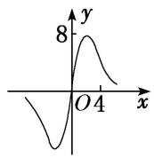
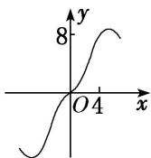
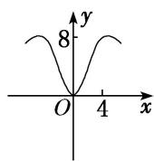
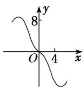

<!-- question-source:start -->
1. (2019·全国III)函数 $y = \frac{2x^3}{2^x + 2^{-x}}$ 在 $[-6, 6]$ 的图象大致为( )

A

B

C

D
<!-- question-source:end -->

![[高中/总复习/专题/函数/专题10 函数的图象及应用-函数/专题十_函数的图象/考点二_函数图象的识别/对点训练/题目/answers/Q00030043A1.md]]
