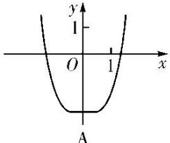
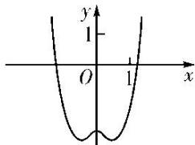
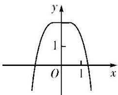
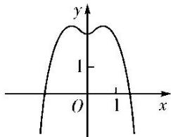

<!-- question-source:start -->
2. (2018·全国III)函数 $y = -x^{4} + x^{2} + 2$ 的图象大致为()

B

C

D
<!-- question-source:end -->

![[高中/总复习/专题/函数/专题10 函数的图象及应用-函数/专题十_函数的图象/考点二_函数图象的识别/对点训练/题目/answers/Q00030044A1.md]]
