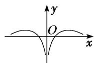
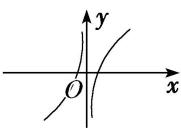
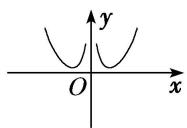

<!-- question-source:start -->
3. 函数 $y = \frac{x^2}{8} - \ln |x|$ 的图象大致为( )

A

B

C

D
<!-- question-source:end -->

![[高中/总复习/专题/函数/专题10 函数的图象及应用-函数/专题十_函数的图象/考点二_函数图象的识别/对点训练/题目/answers/Q00030045A1.md]]
