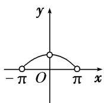
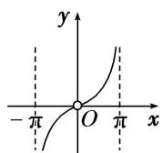
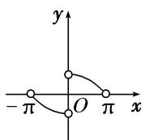
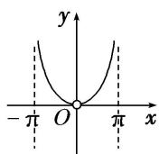

<!-- question-source:start -->
5. 函数 $y=\frac{\sin x}{x}$ ， $x\in(-\pi,0)\cup(0,\pi)$ 的图象大致是()

A

B

C

D
<!-- question-source:end -->

![[高中/总复习/专题/函数/专题10 函数的图象及应用-函数/专题十_函数的图象/考点二_函数图象的识别/对点训练/题目/answers/Q00030047A1.md]]
