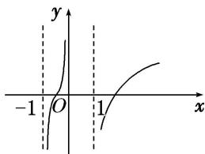

<!-- question-source:start -->
6. 函数 $f(x) = \ln \left( x - \frac{1}{x} \right)$ 的图象是（）

C

D
<!-- question-source:end -->

![[高中/总复习/专题/函数/专题10 函数的图象及应用-函数/专题十_函数的图象/考点二_函数图象的识别/对点训练/题目/answers/Q00030048A1.md]]
