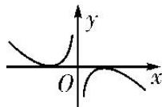
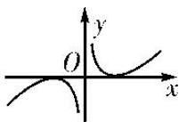
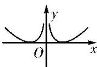

<!-- question-source:start -->
10. 已知函数 $y = f(x)$ 的定义域为 $\{x | x \in \mathbf{R}$ ，且 $x \neq 0\}$ ，且满足 $f(x) - f(-x) = 0$ ，当 $x > 0$ 时， $f(x) = \ln x - x + 1$ ，则函数 $y = f(x)$ 的大致图象为（）

A

B

C

D
<!-- question-source:end -->

![[高中/总复习/专题/函数/专题10 函数的图象及应用-函数/专题十_函数的图象/考点二_函数图象的识别/对点训练/题目/answers/Q00030051A1.md]]
