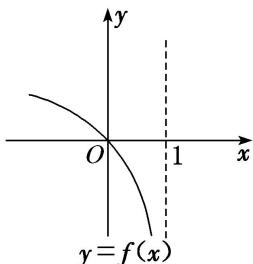
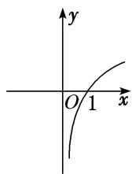
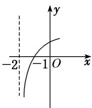
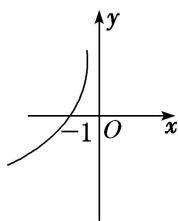
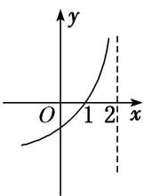

<!-- question-source:start -->
14. 若函数 $y = f(x)$ 的图象如图所示，则函数 $y = -f(x + 1)$ 的图象大致为( )

A

B

C

D
<!-- question-source:end -->

![[高中/总复习/专题/函数/专题10 函数的图象及应用-函数/专题十_函数的图象/考点二_函数图象的识别/对点训练/题目/answers/Q00030055A1.md]]
