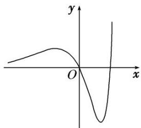

<!-- question-source:start -->
15. 如图所示的图象对应的函数解析式可能是( )

A. $y = 2^{x} - x^{2} - 1$ B. $y = \frac{2^{x}\sin x}{4x + 1}$ C. $y = \frac{x}{\ln x}$ D. $y = (x^{2} - 2x)\mathrm{e}^{x}$
<!-- question-source:end -->

![[高中/总复习/专题/函数/专题10 函数的图象及应用-函数/专题十_函数的图象/考点二_函数图象的识别/对点训练/题目/answers/Q00030056A1.md]]
