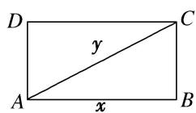
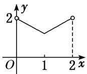
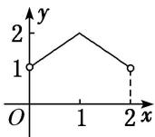
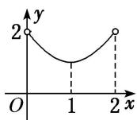
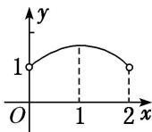

<!-- question-source:start -->
17. 如图, 矩形 $ABCD$ 的周长为 4 , 设 $AB = x$ , $AC = y$ , 则 $y = f(x)$ 的大致图象为 ( )

A

B

C

D
<!-- question-source:end -->

![[高中/总复习/专题/函数/专题10 函数的图象及应用-函数/专题十_函数的图象/考点二_函数图象的识别/对点训练/题目/answers/Q00030058A1.md]]
