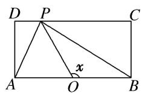
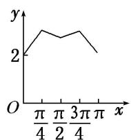
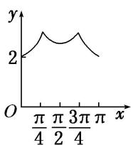
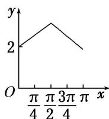
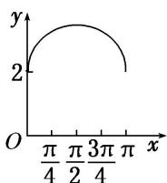

<!-- question-source:start -->
19. (2015·全国II)如图, 长方形 $ABCD$ 的边 $AB = 2$ , $BC = 1$ , $O$ 是 $AB$ 的中点, 点 $P$ 沿着边 $BC$ , $CD$ 与 $DA$ 运动, 记 $\angle BOP = x$ . 将动点 $P$ 到 $A$ , $B$ 两点距离之和表示为 $x$ 的函数 $f(x)$ , 则 $y = f(x)$ 的图象大致为 ( )

A

B

C

D
<!-- question-source:end -->

![[高中/总复习/专题/函数/专题10 函数的图象及应用-函数/专题十_函数的图象/考点二_函数图象的识别/对点训练/题目/answers/Q00030060A1.md]]
