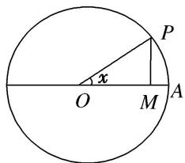
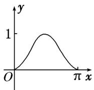
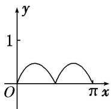
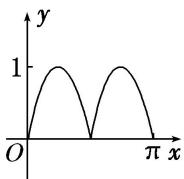
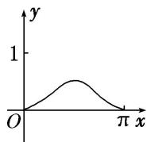

<!-- question-source:start -->
20. (2014·全国I)如图, 圆 $O$ 的半径为 1 , $A$ 是圆上的定点, $P$ 是圆上的动点, 角 $x$ 的始边为射线 $OA$ , 终边为射线 $OP$ , 过点 $P$ 作直线 $OA$ 的垂线, 垂足为 $M$ . 将点 $M$ 到直线 $OP$ 的距离表示成 $x$ 的函数 $f(x)$ , 则 $y = f(x)$ 在 $[0, \pi]$ 的图象大致为( )

A

B

C

D
<!-- question-source:end -->

![[高中/总复习/专题/函数/专题10 函数的图象及应用-函数/专题十_函数的图象/考点二_函数图象的识别/对点训练/题目/answers/Q00030061A1.md]]
