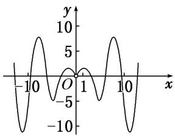
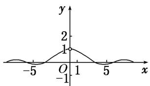
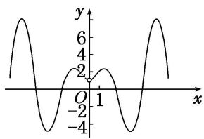
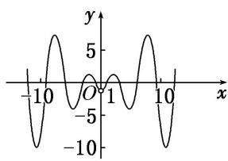

<!-- question-source:start -->
8. 函数 $f(x) = \left( x - \frac{1}{x} \right) \sin x$ 的图象大致是（）

C

B

D
<!-- question-source:end -->

![[高中/总复习/专题/函数/专题10 函数的图象及应用-函数/专题十_函数的图象/考点二_函数图象的识别/对点训练/题目/answers/Q00030123A1.md]]
