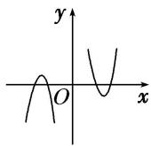
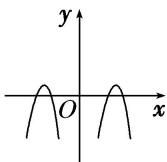

<!-- question-source:start -->
9. 已知函数 $f(x) = -x^2 + 2$ ， $g(x) = \log_2 |x|$ ，则函数 $F(x) = f(x) \cdot g(x)$ 的图象大致为（）

A

B

C

D
<!-- question-source:end -->

![[高中/总复习/专题/函数/专题10 函数的图象及应用-函数/专题十_函数的图象/考点二_函数图象的识别/对点训练/题目/answers/Q00030124A1.md]]
