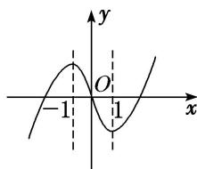

> [!faq]- 《专题十 函数图象的应用(教师版)》例题解析
>
> > [!success]- **【答案】** C
>
> > [!note]- **【解析】**
> > 答案 C 解析 将函数 $f(x)=x|x|-2x$ 去掉绝对值得 $f(x)=\left\{\begin{aligned}x^{2}-2x,&x\geq0,\\ -x^{2}-2x,&x<0,\end{aligned}\right.$ 画出函数 $f(x)$ 的图象，如图，
> >
> > 
> >
> > 观察图象可知，函数 $f(x)$ 的图象关于原点对称，故函数 $f(x)$ 为奇函数，且在 $(-1, 1)$ 上单调递减.
