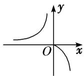
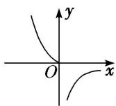
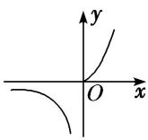
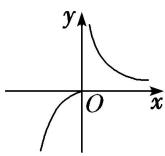

<!-- question-source:start -->
13. 已知函数 $f(x) = \begin{cases} x^2, & x \geq 0 \\ \frac{1}{x}, & x < 0 \end{cases}$ ， $g(x) = -f(-x)$ ，则函数 $g(x)$ 的图象是（）

  
A

B

  
D

C
<!-- question-source:end -->

![[高中/总复习/专题/函数/专题10 函数的图象及应用-函数/考点02_函数图象的识别/对点训练/answers/Q00056076A1.md]]
