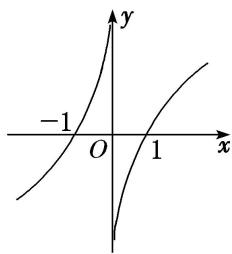

<!-- question-source:start -->
16. 函数 $f(x)$ 的大致图象如图所示，则函数 $f(x)$ 的解析式可以是()

A. $f(x) = x^{2}\cdot \sin |x|$ B. $f(x) = \left(\frac{x - \frac{1}{x}}{x}\right)\cdot \cos 2x$ C. $f(x) = (\mathrm{e}^x -\mathrm{e}^{-x})\cos \left(\frac{\pi}{2} x\right)$ D. $f(x) = \frac{x\ln|x|}{|x|}$
<!-- question-source:end -->

![[高中/总复习/专题/函数/专题10 函数的图象及应用-函数/考点02_函数图象的识别/对点训练/answers/Q00056079A1.md]]
