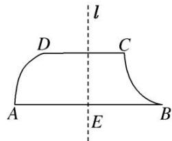
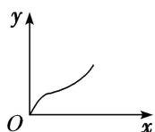
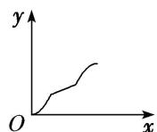
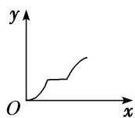

<!-- question-source:start -->
18. 如图, 不规则四边形 $ABCD$ 中, $AB$ 和 $CD$ 是线段, $AD$ 和 $BC$ 是圆弧, 直线 $l \perp AB$ 交 $AB$ 于 $E$ , 当 $l$ 从左至右移动 (与线段 $AB$ 有公共点) 时, 把四边形 $ABCD$ 分成两部分, 设 $AE = x$ , 左侧部分的面积为 $y$ , 则 $y$ 关于 $x$ 的图象大致是 ( )

A

B

C

D
<!-- question-source:end -->

![[高中/总复习/专题/函数/专题10 函数的图象及应用-函数/考点02_函数图象的识别/对点训练/answers/Q00056081A1.md]]
