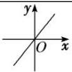
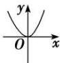
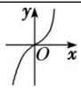
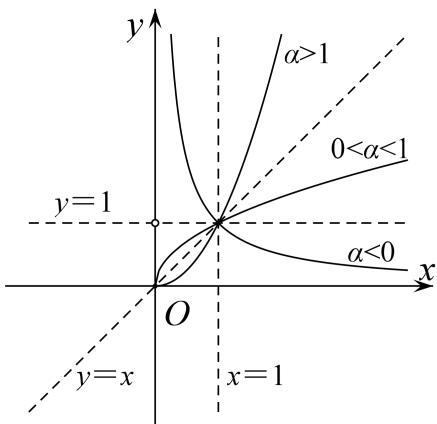

## 专题十一 幂函数

## 1. 幂函数的概念

一般地，形如 $y=x^{\alpha}(\alpha\in\mathbf{R})$ 的函数称为幂函数，其中底数 x 是自变量， $\alpha$ 为常数.

## 2. 五种常见幂函数的图象与性质

<table><tr><td>函数特征性质</td><td> $y=x$ </td><td> $y=x^{2}$ </td><td> $y=x^{3}$ </td><td> $y=x\frac{1}{2}$ </td><td> $y=x^{-1}$ </td></tr><tr><td>图象</td><td></td><td></td><td></td><td></td><td></td></tr><tr><td>定义域</td><td>R</td><td>R</td><td>R</td><td>{x|x≥0}</td><td>{x|x≠0}</td></tr><tr><td>值域</td><td>R</td><td>{y|y≥0}</td><td>R</td><td>{y|y≥0}</td><td>{y|y≠0}</td></tr><tr><td>奇偶性</td><td>奇</td><td>偶</td><td>奇</td><td>非奇非偶</td><td>奇</td></tr><tr><td>单调性</td><td>增</td><td>(-∞,0)减,(0,+∞)增</td><td>增</td><td>增</td><td>(-∞,0)和(0,+∞)减</td></tr><tr><td>公共点</td><td colspan="5">(1,1)</td></tr></table>

## 3. 常用结论

幂函数的图象特征与性质

对于幂函数图象的掌握只要抓住在第一象限内三条线分第一象限为六个区域，即 $x = 1$ ， $y = 1$ ， $y = x$ 分区域．根据 $\alpha < 0$ ， $0 < \alpha < 1$ ， $\alpha = 1$ ， $\alpha > 1$ 的取值确定位置后，其余象限部分由奇偶性决定.

(1)幂函数在 $(0, +\infty)$ 上都有定义；

(2)幂函数的图象过定点(1, 1);

(3)当 $\alpha > 0$ 时，幂函数的图象都过点(1, 1)和(0, 0)，且在 $(0, +\infty)$ 上单调递增，特别地，当 $\alpha > 1$ 时，幂函数的图象下凸；当 $0 < \alpha < 1$ 时，幂函数的图象上凸；

(4)当 $\alpha<0$ 时，幂函数的图象都过点(1,1)，且在 $(0,+\infty)$ 上单调递减；

(5)幂指数互为倒数的幂函数在第一象限内的图象关于直线 y=x 对称.

(6)在第一象限，作直线 $x = a(a > 1)$ ，它同各幂函数图象相交，按交点从下到上的顺序，幂指数按从小到大的顺序排列.

(7)对于形如 $f(x) = x^{\alpha}$ (其中 $\alpha \in \mathbf{Z}$ ), 当 $\alpha$ 为奇数时, 幂函数为奇函数, 图象关于原点对称; 当 $\alpha$ 为偶数时,

幂函数为偶函数，图象关于 y 轴对称.

(8)对于形如 $f(x) = x^{\frac{n}{m}}$ (其中 $m \in \mathbf{N}^{*}$ , $n \in \mathbf{Z}$ , $m$ 与 $n$ 互质)的幂函数的奇偶性:

①当 n 为偶数时， $f(x)$ 为偶函数，图象关于 y 轴对称；

②当 m, n 都为奇数时， $f(x)$ 为奇函数，图象关于原点对称；

③当 m 为偶数时， $x>0$ （或 $x\geq0$ ）， $f(x)$ 是非奇非偶函数，图象只在第一象限（或第一象限及原点处）.

![[高中/总复习/专题/函数/专题11 幂函数-函数/专题十一_幂函数/考点一_幂函数的图象及其应用/考点一_幂函数的图象及其应用.md]]
![[高中/总复习/专题/函数/专题11 幂函数-函数/专题十一_幂函数/考点二_幂函数性质的综合应用/考点二_幂函数性质的综合应用.md]]
