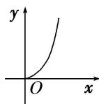
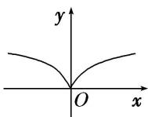
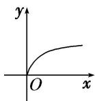
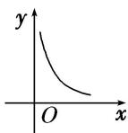
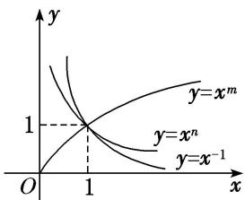
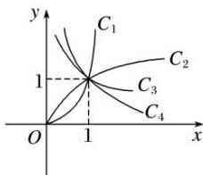
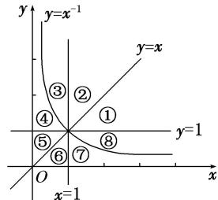

<!-- question-source:start -->
[例 1] (1) 若幂函数 $y=(m^{2}-3m+3)\cdot x^{m2-m-2}$ 的图象不过原点，则 m 的取值是( )

A. $-1 \leq m \leq 2$ B. m = 1 或 m = 2 C. m = 2 D. m = 1

(2) 幂函数 $y = f(x)$ 的图象过点(4, 2)，则幂函数 $y = f(x)$ 的图象是()

A

B

C

D

答案 C

(3) 若幂函数 $y = x^{-1}$ ， $y = x^{m}$ 与 $y = x^{n}$ 在第一象限内的图象如图所示，则 $m$ 与 $n$ 的取值情况为（）

A. $-1 < m < 0 < n < 1$ B. $-1 < n < 0 < m$ C. $-1 < m < 0 < n$ D. $-1 < n < 0 < m < 1$

(4)如图所示, 图中的曲线是幂函数 $y = x^n$ 在第一象限的图象, 已知 $n$ 取 $\pm 2$ , $\pm \frac{1}{2}$ 四个值, 则相应于 $C_1$ , $C_2$ , $C_3$ , $C_4$ 的 $n$ 依次为 ( )

A. $-2, -\frac{1}{2}, \frac{1}{2}, 2$ B. $2, \frac{1}{2}, -\frac{1}{2}, -2$ C. $-\frac{1}{2}, -2, 2, \frac{1}{2}$ D. $2, \frac{1}{2}, -2, -\frac{1}{2}$

(5)幂函数 $y = x^{-1}$ 及直线 $y = x, y = 1, x = 1$ 将平面直角坐标系的第一象限分成八个“卦限”：①，②，③，④，⑤，⑥，⑦，⑧(如图所示)，则幂函数 $y = x^{\frac{1}{2}}$ 的图象经过的“卦限”是（）

A. ④, ⑦ B. ④, ⑧ C. ③, ⑧ D. ①, ⑤

(6) 当 0 < x < 1 时， $f(x) = x^{2}$ ， $g(x) = x^{\frac{1}{2}}$ ， $h(x) = x^{-2}$ ，则 $f(x)$ ， $g(x)$ ， $h(x)$ 的大小关系是 \_\_\_\_.
<!-- question-source:end -->

![[高中/总复习/专题/函数/专题11 幂函数-函数/专题十一_幂函数/考点一_幂函数的图象及其应用/例题选讲/例题/answers/Q00030142A1.md]]
