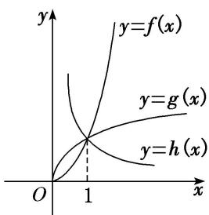

> [!faq]- 教师版例题解析
>
> > [!success]- **【答案】** (1) B；(2) D；(3) B；(4) D；(5) $h(x) > g(x) > f(x)$
>
> > [!note]- **【分析】**
> > 本题未单列分析。
>
> > [!note]- **【解析】**
> > 答案 B 解析 由幂函数性质可知 $m^2 - 3m + 3 = 1$ ， $\therefore m = 1$ 或 $m = 2$ 。又幂函数图象不过原点， $\therefore m^2 - m - 2 \leq 0$ ，即 $-1 \leq m \leq 2$ ， $\therefore m = 1$ 或 $m = 2$ 。
> > 答案 D 解析 幂函数 $y=x^{a}$ ，当 $\alpha>0$ 时， $y=x^{a}$ 在 $(0,+\infty)$ 上为增函数，且 $0<m<1$ 时，图象上凸，∴ 0<m<1；当 $\alpha<0$ 时， $y=x^{a}$ 在 $(0,+\infty)$ 上为减函数，不妨令 x=2，根据图象可得 $2^{-1}<2^{n}$ ，∴ -1<n<0，综上所述，故选 D.
> > 答案 B 解析 根据幂函数 $y = x^n$ 的性质，在第一象限内的图象当 $n > 0$ 时， $n$ 越大， $y = x^n$ 递增速度越快，故 $C_1$ 的 $n = 2$ ， $C_2$ 的 $n = \frac{1}{2}$ ；当 $n < 0$ 时， $|n|$ 越大，曲线越陡峭，所以曲线 $C_3$ 的 $n = -\frac{1}{2}$ ，曲线 $C_4$ 的 $n = -2$ .
> > 答案 D 解析 由 $y = x^{\frac{1}{2}} = \sqrt{x}$ 知其经过“卦限”①⑤，故选 D.
> > 答案 $h(x) > g(x) > f(x)$ 解析 分别作出 $y = f(x)$ , $y = g(x)$ , $y = h(x)$ 的图象如图所示, 可知 $h(x) > g(x) > f(x)$ .
> > 
