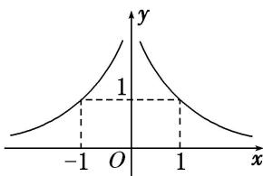

<!-- question-source:start -->
4. 幂函数 $y = x^{m^2 - 2m - 3} (m \in \mathbf{Z})$ 的图象如图所示，则 $m$ 的值为（）

A. -1 B. 0 C. 1 D. 2
<!-- question-source:end -->

![[高中/总复习/专题/函数/专题11 幂函数-函数/专题十一_幂函数/考点一_幂函数的图象及其应用/对点训练/题目/answers/Q00030146A1.md]]
