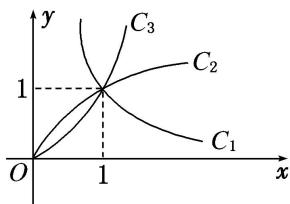

<!-- question-source:start -->
6. 图中 $C_1, C_2, C_3$ 为三个幂函数 $y = x^k$ 在第一象限内的图象，则解析式中指数 $k$ 的值依次可以是( )

A. $-1, \frac{1}{2}, 3$ B. $-1, 3, \frac{1}{2}$ C. $\frac{1}{2}, -1, 3$ D. $\frac{1}{2}, 3, -1$
<!-- question-source:end -->

![[高中/总复习/专题/函数/专题11 幂函数-函数/专题十一_幂函数/考点一_幂函数的图象及其应用/对点训练/题目/answers/Q00030148A1.md]]
