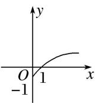
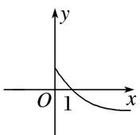
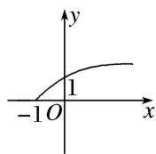
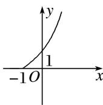

<!-- question-source:start -->
5. 函数 $y = x^{\overline{2}} - 1$ 的图象关于 x 轴对称的图象大致是()

A

B

C

D
<!-- question-source:end -->

![[高中/总复习/专题/函数/专题11 幂函数-函数/考点01_幂函数的图象及其应用/对点训练/answers/Q00041052A1.md]]
