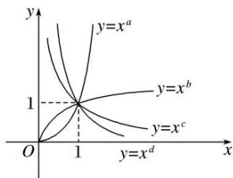

<!-- question-source:start -->
7. 若四个幂函数 $y = x^{a}$ , $y = x^{b}$ , $y = x^{c}$ , $y = x^{d}$ 在同一坐标系中的图象如图所示, 则 $a, b, c, d$ 的大小关系是( )

A. $d > c > b > a$ B. $a > b > c > d$ C. $d > c > a > b$ D. $a > b > d > c$
<!-- question-source:end -->

![[高中/总复习/专题/函数/专题11 幂函数-函数/考点01_幂函数的图象及其应用/对点训练/answers/Q00041054A1.md]]
