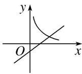
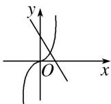
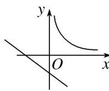

<!-- question-source:start -->
8. 在同一坐标系内，函数 $y = x^{a} (a \neq 0)$ 和 $y = ax - \frac{1}{a}$ 的图象可能是（）

A

B

C

D
<!-- question-source:end -->

![[高中/总复习/专题/函数/专题11 幂函数-函数/考点01_幂函数的图象及其应用/对点训练/answers/Q00041055A1.md]]
